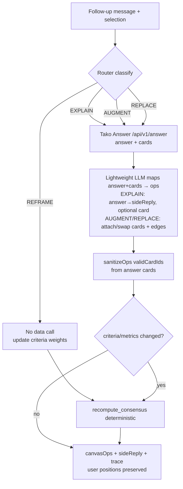
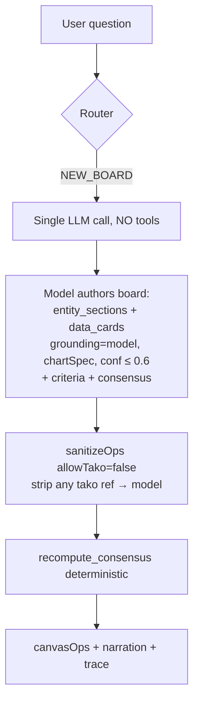
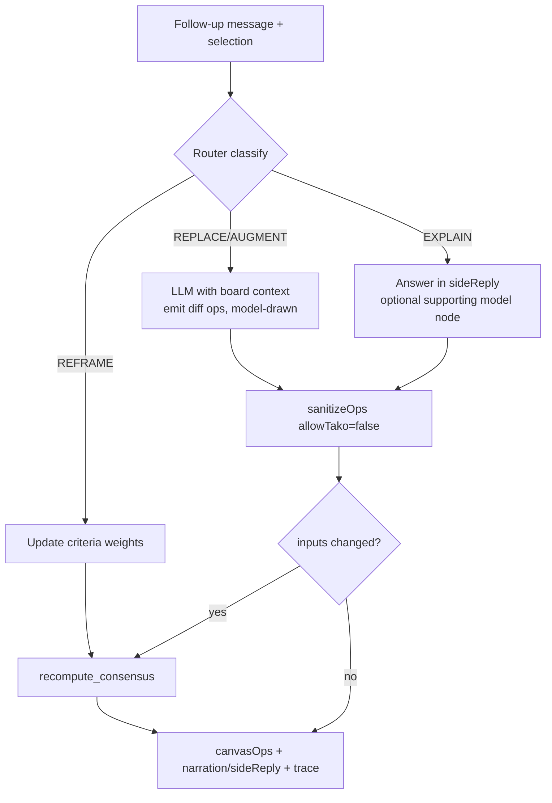

# Agent Architecture — Decision Trees

canvas-tako runs three providers — `gpt`, `claude` (baselines, no tools), and `tako`
(grounded, fixed to a fast `gpt-5.4-mini` for its internal LLM sub-steps) — behind a single
modular seam (`lib/providers/index.ts`). The grounding **decision tree is identical across
every provider; only the fidelity of the grounding step changes.** Baselines answer from
model knowledge and draw their own charts (`grounding:"model"`, capped confidence, never a
Tako ref); the `tako` provider grounds through the graph + `/v3/search` (initial research)
or Tako Answer (follow-ups), producing cited, embeddable knowledge cards. The four diagrams
below are the visual guide to that shared tree, split by provider and by initial-research
vs. follow-up-research turns.

## Tako agent — initial research (NEW_BOARD)

```mermaid
flowchart TD
  A[User question] --> R{Router}
  R -->|NEW_BOARD| B[LLM: breakdown → entities / metrics]
  B --> S[graph/search per part<br/>types=entity|metric, subtype if ambiguous]
  S --> P[Pick best node<br/>top relevance / LLM tie-break]
  P --> Rel[graph/related<br/>q=topic, popularity-ordered, top few]
  Rel --> C[LLM COMPOSE<br/>grounded v3/search queries<br/>from names + aliases + entity-level]
  C --> D[Dedupe + cap]
  D --> Q[v3/search concurrently<br/>keep top cards]
  Q --> Y[LLM synthesize board<br/>data_cards from AVAILABLE_CARDS only<br/>+ criteria + consensus + gap text nodes]
  Y --> Z[sanitizeOps validCardIds]
  Z --> CO[recompute_consensus deterministic]
  CO --> OUT[canvasOps + narration + trace]
  S -.->|graph 403/err| C
```

## Tako agent — follow-up research



## Baseline agent — initial research (NEW_BOARD)



## Baseline agent — follow-up research


