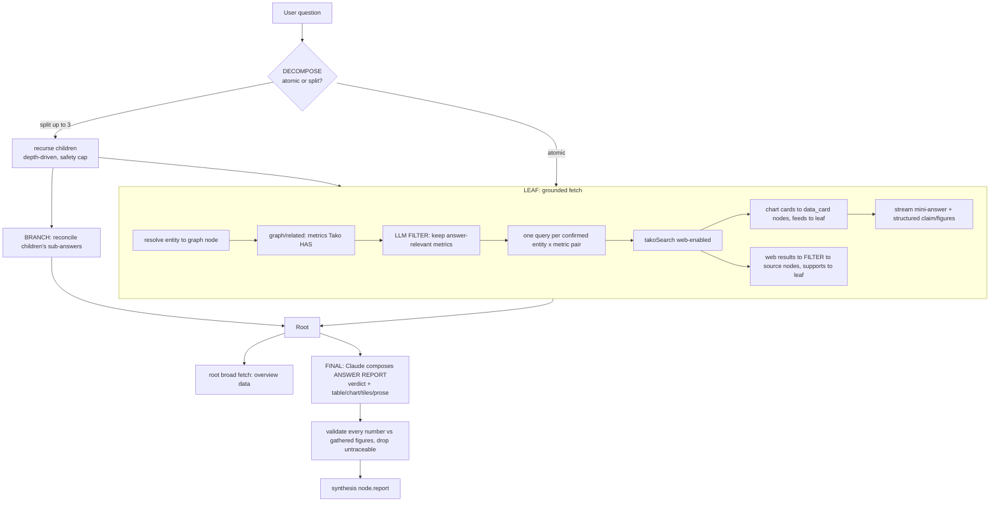

# Agent Architecture

canvas-tako turns a question into a **spatial research canvas**: a recursive agent
explores the question, pulls grounded Tako data, and composes a multi-representation
answer. This doc is the living reference for the tech stack and the agent flow.

## Tech stack

| Layer | Choice | Why |
|-------|--------|-----|
| App | **Next.js 14.2**, **React 18.3** | Server route for the agent (`app/api/agent/route.ts`); client canvas (`app/page.tsx`). |
| LLM | **Vercel AI SDK `ai@4`** + `@ai-sdk/openai`, `@ai-sdk/anthropic` | `generateObject` (Zod-validated structured output) + `streamText` (token streaming). Pinned to `ai@4` for React 18.3 / Next 14.2 (server-only path, no React-19 UI hooks). |
| Validation | **Zod** | Every structured LLM step is schema-validated (`lib/agents/shared/schemas.ts`, `lib/schema.ts`). |
| Graph | **graphology** | Structural edge validation (cycle/fan-in) in `lib/relate.ts`. |
| Models | `gpt-5.4-mini` (sub-agents, decompose, filters), **Claude** via `ANTHROPIC_MODEL` (final answer report) | Cheap fast model for the many sub-steps; deep reasoning only for the final composed answer. |

**Not LangChain/LangGraph.** The workload is a stateless recursive *tree*, not a
cyclic supervisor graph — no checkpointing, cycles, or human-in-the-loop. A
hand-rolled recursion on the AI SDK is simpler, keeps the bespoke canvas
streaming, and avoids the dependency + rewrite cost. LangGraph's ideas (dynamic
depth, explicit per-node state) are adopted without the framework.

## System layers (request → canvas)

```
 Browser (app/page.tsx)                         Server (Next route)
 ┌───────────────────────────┐   POST /api/agent  ┌────────────────────────────┐
 │ chat + canvas             │ ─────────────────▶ │ app/api/agent/route.ts     │
 │  · applies ops live       │                    │  builds AgentRequest        │
 │  · streams tokens         │ ◀───── NDJSON ──── │  runProvider()              │
 │  · TraceView provenance   │  ops/token/trace   └─────────────┬──────────────┘
 └───────────────────────────┘                                  │
                                          lib/providers/registry.ts
                                    ┌────────────────┬───────────┴───────────┐
                                    ▼                ▼                       ▼
                               gpt (baseline)   claude (baseline)      tako (grounded)
                               web search +     web search +           runTakoInitial()
                               model charts     model charts           = the engine below
```

## Providers

Three providers behind one seam (`lib/providers/registry.ts`):
- **`gpt` / `claude`** — baselines: answer from model knowledge + the provider's
  native web search, draw their own charts (`grounding:"model"|"web"`, never a Tako ref).
- **`tako`** — grounded: the recursive research engine below.

## The `tako` recursive research engine

Entry: `runProvider` → `runTakoInitial` (`lib/agents/tako/pipeline.ts`) →
`research()` (`lib/agents/tako/research.ts`). One turn builds a tree; every node
streams onto the canvas live via NDJSON events.

### Flow (ASCII — visible in any viewer)

```
 user question
      │
      ▼
 ┌─────────────┐   atomic?
 │  DECOMPOSE  │───────────────┐ yes → LEAF
 │ (gpt-mini)  │               │
 └─────┬───────┘ split ≤3      │
       │ (per genuine facet)   │
       ▼                       │
   recurse each sub-question   │   (depth-driven; MAX_DEPTH & node budget = safety caps)
       │                       │
       ▼                       ▼
   ┌───────────────── LEAF: grounded fetch ─────────────────┐
   │ resolve entity → graph node                            │
   │ graph/related → metrics Tako ACTUALLY has              │
   │ LLM FILTER → keep only answer-relevant metrics         │
   │ compose ONE query per confirmed entity×metric pair     │  ← no repeats / no ungrounded
   │ takoSearch (web on):                                   │
   │    chart cards ─ feeds→ leaf  (finding grid)           │
   │    web results ─ FILTER ─ source nodes ─ supports→ leaf│
   │ stream mini-answer + structured {claim, figures, conf} │
   └───────────────────────────┬────────────────────────────┘
       │ (branch node reconciles its children's sub-answers)
       ▼
   ┌─────────────────────── ROOT ───────────────────────────┐
   │ broad fetch (overview data for the whole question)      │
   │ gather all {claim, figures} + web sources               │
   │ FINAL LAYER = Claude (ANTHROPIC_MODEL; GPT fallback):   │
   │    compose ANSWER REPORT = {verdict, blocks[]}          │
   │      blocks ∈ prose | table | chart | tiles             │
   │ VALIDATE every number vs gathered figures →             │
   │      drop anything untraceable (no hallucinated data)   │
   │ store on synthesis node.report                          │
   └─────────────────────────────────────────────────────────┘
```



### Key principles
- **Grounded queries.** Queries are composed *only* from confirmed entity×metric
  pairs the graph actually has (`resolveGraph` → `METRIC_FILTER_SYSTEM` → one query
  per pair). No overview/ungrounded/duplicate queries; gaps are recorded, not guessed.
- **Depth matches the question.** A node branches only when the LLM judges it
  non-atomic (≤3 sub-questions/level); simple prompts stay one level. `MAX_DEPTH`
  + `TOTAL_RESEARCH_CAP` are safety bounds, not the intended stop.
- **No duplicate cards.** `FindingLedger` dedups by cardId/embed; a card found by a
  second branch is reused (one node) with a `supports` edge to that branch, never
  re-added (`lib/agents/tako/findings.ts` `lookup`).
- **Reconciling consensus.** Each branch returns `{claim, keyFigures, confidence}`;
  the root reconciles agreements/tensions into a decisive verdict.
- **Composed answer, grounded numbers.** The final layer (Claude,
  `lib/agents/tako/compose.ts`) emits an ordered `AnswerReport`
  (`{verdict, blocks:[prose|table|chart|tiles]}`); every number is validated
  against the gathered figures and dropped if untraceable.
- **Left "Sources" column.** Web-grounded sources (embed-less Tako answer cards,
  `grounding: "web"`) render as clickable nodes in a left column, `supports`-linked
  to the answers that used them. On the initial turn, publisher provenance stays on
  each chart card (which already shows its Tako source); it is not rolled up into
  separate source nodes.

## Nodes & edges (`lib/schema.ts`) — how the canvas looks

```
  Web sources          ┌──────────────────────────────────────┐
  (left column)        │        SYNTHESIS  (root answer)       │   role: synthesis
  ┌───────────┐        │  **verdict**                          │   carries .report:
  │ BLS       │┄┄supports┤  [tiles] [table] [chart] [prose]     │   verdict + blocks
  │ FRED      │┄┄┄┄┄┄┄┄┄▶│                                      │
  │ Reuters   │         └───────▲───────────────▲──────────────┘
  └───────────┘                 │ derived_from  │ derived_from
                        ┌────────┴─────┐   ┌─────┴────────┐
                        │  RESEARCH    │   │  RESEARCH    │        role: research
                        │  sub-answer  │   │  sub-answer  │        (a facet)
                        └───▲──────▲───┘   └───▲──────────┘
                     feeds  │      │ feeds     │ feeds
                        ┌───┴──┐ ┌─┴────┐   ┌──┴───┐
                        │chart │ │chart │   │chart │               data_card findings
                        │ card │ │ card │   │ card │               (finding grid)
                        └──────┘ └──────┘   └──────┘
```

- **Node roles:** `synthesis` (root answer, carries `report`), `research` (sub-answer),
  `source` (clickable publisher/article, left column), plus finding `data_card`s.
- **Edge kinds:** `feeds` (card → its leaf), `derived_from` (child → parent → root),
  `supports` (source / reused card → the answer it informs).
- **Layout** (`lib/layout.ts` `treeLayout`): depth rows top-to-bottom, each parent
  centered over its children, a ≤2-col finding grid under each leaf, and web/publisher
  sources stacked in a left column. Extent recursion guarantees no sibling overlap at
  any depth. A card used by two branches is one node with a `feeds` edge to the first
  and `supports` edges to the rest — never duplicated.

## Streaming / event contract (`lib/agents/shared/types.ts`)

The route relays every event as NDJSON; the client (`app/page.tsx`) applies them live:
- `ops` — canvas node/edge ops (graphs stream in as searches resolve).
- `token` `{nodeId}` — sub-answer prose streaming into a research node.
- `reasoning` / `tako_call` / `synthesis` — trace steps (rationale, query→cards,
  synth start/end) that power the per-turn `TraceView` and per-node provenance.

## Observability

- **npm console:** `lib/log.ts` + `lib/tako.ts` log every Tako call (endpoint,
  query, ms, card count) and each agent decision, human-readably.
- **On the canvas:** research/synthesis nodes show their `🔍 searched` queries; the
  chat `TraceView` (`components/TraceView.tsx` + `TakoCallRow`/`CardProvenance`)
  shows the full per-node query→cards + reasoning drill-down.
