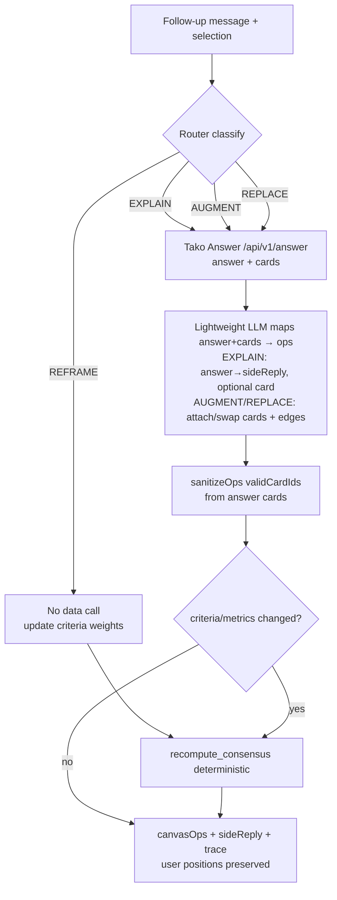
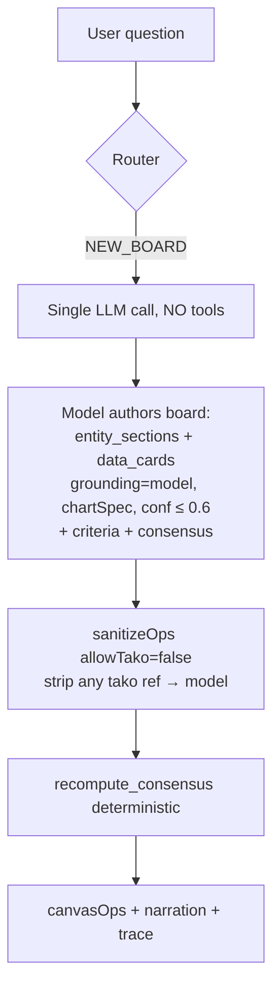
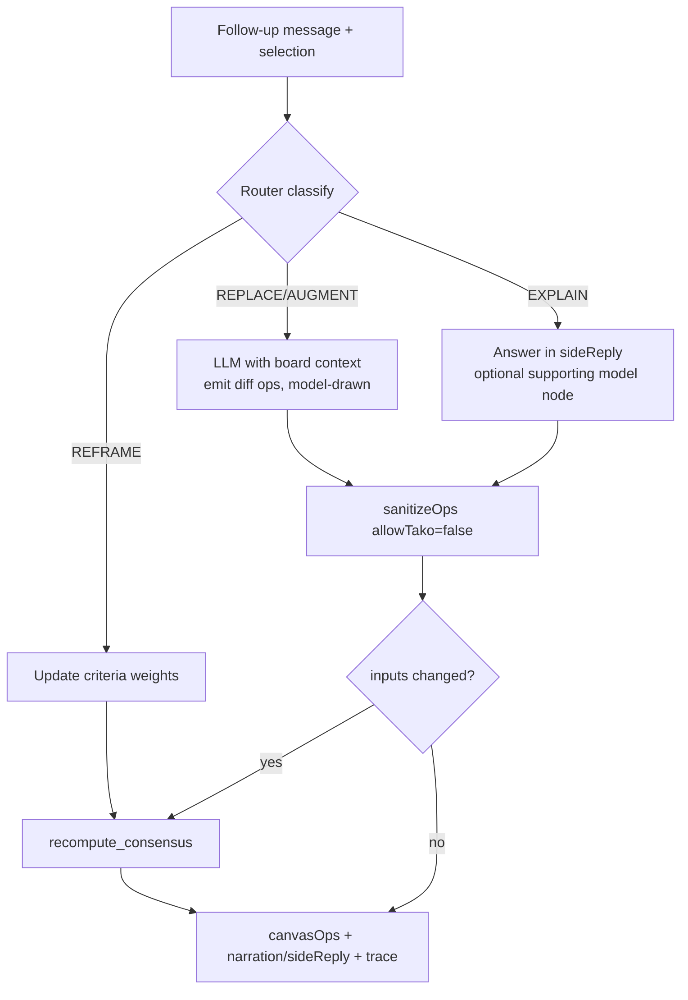

# Spatial Research Canvas — Polish & Graph-Agent Design

**Date:** 2026-07-06
**Status:** Approved design → implementation plan
**Repo:** `canvas-tako`

---

## Context

`canvas-tako` is a working-but-plain Next.js 14 + TypeScript starter for a **spatial
research canvas**: a chat-driven infinite canvas that turns a research question into a
board of connected, cited data cards converging on a consensus leaderboard. Its purpose
is to make the value of **Tako** (structured-data API) obvious by running the *same*
board under different data providers and seeing the difference.

Two goals drive this effort:

1. **Product polish** — take it from "functional starter" to a polished, delightful,
   genuinely easy-to-use analyst tool, without breaking the core invariants.
2. **Graph-first Tako agent** — the Tako provider must use the **Tako graph API**
   (`/beta/graph/search`, `/beta/graph/related`) to resolve the question to real graph
   nodes *before* searching, compose grounded `/v3/search` queries from resolved
   names + aliases, and honestly report coverage gaps. This is the search optimization
   that shows off Tako's structured-data advantage.

The current state: 10 source files, hand-rolled pan/zoom, inline styles, 4 providers
(`gpt`, `claude`, `gpt_tako`, `claude_tako`), a blind 3-step `knowledge_search` Tako flow,
a no-op `recompute_consensus`, no persistence, no tests.

---

## Invariants (must not break)

1. **Modular provider seam.** Adding/swapping a provider stays a one-entry change behind
   a typed registry. No provider logic in the UI or route.
2. **The agent is a pure function** `(message, canvasState, selection, provider, flags, onTrace?) → { canvasOps, narration, sideReply, trace }`. The frontend only applies ops.
   `onTrace` is a progress callback, not a rendering side-effect — it does not leak state
   into rendering.
3. **Honest grounding.** Baselines (`gpt`, `claude`) can NEVER attach a Tako ref and are
   capped at low confidence (≤ 0.6). The grounded provider may only use cards actually
   fetched that turn; hallucinated `cardId`s are stripped and the node downgraded to
   `model` (via `sanitizeOps`). Never fabricate numbers, sources, or dates. Report gaps.
4. **All providers stay live** and server-side; keys never reach the client.
5. **Scene-graph is canonical.** `@xyflow/react` renders *from* `CanvasState`; it never
   becomes the source of truth. `applyOps` drives everything.

---

## Verified Tako facts (tested 2026-07-06)

- **Host bug:** the app defaults to `staging.trytako.com`, which is **Cloudflare-blocked**
  (403 on `/api/*` before reaching the API). The correct staging host is
  **`staging.tako.com`**. Fix `TAKO_HOST` default + `.env.example`.
- Staging has its **own key namespace**: the current `tako_sk_…` staging key works on
  `staging.tako.com`; prod `tako.com` returns 401 for it (and vice-versa).
- Verified working on `staging.tako.com` with the current key:
  - `GET /api/beta/graph/search?q=nvidia&types=entity` → 200, `{results:[{id,name,subtype,aliases,description}]}`
  - `GET /api/beta/graph/related?node_id=…&relation_type=metric&q=revenue` → 200,
    `{relation:{items:[{id,name,aliases,description}], total, next_cursor}}` (popularity-ordered)
  - `POST /api/v3/search` `{query,effort,sources:{data:{count}}}` → 200,
    `{cards:[{card_id,title,description,webpage_url,image_url,embed_url,sources,card_type,relevance_score}]}`
  - `POST /api/v1/answer` `{query,effort}` → 200,
    `{answer:string, cards:[{card_id,title,embed_url,webpage_url,image_url,sources,card_type,…}], web_results, request_id}`
    — a grounded natural-language answer **plus** citable cards (valid `card_id`s).
- **Migrate Tako search from `/api/v1/knowledge_search` to `/api/v3/search`** — cleaner
  shape, matches the graph-agent skill, works on staging.
- **Tako Answer = `POST /api/v1/answer`** — used for follow-ups/responses (see §2).
- v3 embeds post their height via a `tako::resize` postMessage — **do not hard-code
  iframe heights**; listen for the resize message.

---

## 0. Strict structured output & deterministic architecture (cross-cutting)

The agent must **reason explicitly about how information connects** and represent it in a
**strict, schema-enforced format**. Two mechanisms, applied everywhere:

### Strict format — Zod schemas + AI SDK
- **Zod schemas are the single source of truth** for the scene-graph contract
  (`CanvasNode`, `CanvasEdge`, `EdgeKind`, `CanvasOp`, `AgentResponse`) and for every agent
  sub-step (breakdown, node-pick, compose-queries, synthesis, follow-up). TS types are
  derived via `z.infer` — schema and type never drift. Lives in `lib/schema.ts` +
  per-agent `schemas.ts`.
- **`lib/llm.ts` is rewritten around the Vercel AI SDK.** `generateObject({ schema, … })`
  constrains and validates output (auto-retry on mismatch); `streamObject`/`streamText`
  power the narrated trace + chat. `@ai-sdk/openai` / `@ai-sdk/anthropic` unify both
  providers and give Anthropic the schema enforcement it lacks natively. `extractJson`
  brace-slicing is removed — validation is structural, not textual.

### Reasoning about connections — the "relate" step
The agent treats relationships as first-class, split into deterministic vs reasoned:
- **Deterministic edges (code, not model)** — generated in `lib/relate.ts` using
  **`graphology`**: every `evidence` card in a section `feeds` its `consensus`; `sibling`
  edges link the same metric across entities; `derived_from` when a metric cites another
  node. These follow structural rules, so code owns them.
- **Reasoned edges (LLM, strict schema)** — only the semantic judgments
  (`supports` / `contradicts`: did this evidence raise or lower an entity's rank?) are
  produced by the model, emitted as schema-validated `add_edge` ops.
- **Validation (deterministic)** — `graphology` validates the resulting graph before ops
  are applied: dedupe edges, guarantee consensus connectivity, reject cycles, and
  suppress hairballs (drop low-signal edges over a density threshold). "A sparse board
  beats a hairball."

### Deterministic code architecture — used wherever it's available
| Concern | Owner |
|---|---|
| Consensus ranking (`score = Σ weightₖ × normalize(metricₖ)`) | `lib/consensus.ts` (code) |
| Metric normalization (min-max across entities) | `lib/consensus.ts` (code) |
| Structural edges + graph validation | `lib/relate.ts` + `graphology` (code) |
| Layout (fan-in columns; "tidy" via `dagre`) | `lib/layout.ts` (code) |
| Output schema conformance | Zod + AI SDK (code-enforced) |
| Cohort/query wording, semantic edges, prose | LLM (strict schema) |

Rule of thumb: **if a step has a correct deterministic answer, code owns it**; the model
is reserved for genuinely open reasoning (wording, semantic judgment, synthesis). This is
what makes rankings reproducible and the provider comparison honest.

## 1. Provider architecture (3 providers)

Replace the 4-provider set with **three**, per the new requirement:

| id | label | LLM | Tools | Capabilities |
|---|---|---|---|---|
| `gpt` | GPT | OpenAI (`OPENAI_MODEL`) | none | `{ structured_cards:false, tako_search:false }` |
| `claude` | Claude | Anthropic (`ANTHROPIC_MODEL`) | none | `{ structured_cards:false, tako_search:false }` |
| `tako` | LLM + Tako | **gpt-5.4-mini (fixed)** | Tako graph + v3 search + answer | `{ structured_cards:true, tako_search:true, tako_graph:true, tako_answer:true }` |

- Drop `gpt_tako` / `claude_tako`. The grounded agent is a **single provider** `tako`,
  hard-wired to gpt-5.4-mini (no Claude variant), because the graph pipeline is tuned
  around one composer model.
- **New default provider:** `tako`.
- **Typed registry** (`lib/providers/registry.ts`):
  ```ts
  export interface ProviderCapabilities {
    structured_cards: boolean; tako_search: boolean; tako_graph: boolean;
    tako_answer: boolean; web_search: boolean;
  }
  export interface ProviderDef {
    id: ProviderId; label: string; capabilities: ProviderCapabilities;
    run: (req: AgentRequest, onTrace?: TraceFn) => Promise<AgentResponse>;
  }
  export const PROVIDERS: Record<ProviderId, ProviderDef>;
  ```
  Adding a provider = one entry + one `run*` function. The router branches on
  `capabilities`, not on the id string.
- `ProviderId` in `lib/schema.ts` becomes `"gpt" | "claude" | "tako"`.

### File layout for the agentic core (modular, one prompts file per agent)

```
lib/
  agents/
    shared/
      schemas.ts          # Zod schemas: CanvasOp[], AgentResponse, sub-step outputs (source of truth)
      router.ts           # ROUTER prompt + route classification helper
      ctx.ts              # ctxBlock(req): slim board projection for prompts
      types.ts            # TraceFn, TurnTrace, AgentContext (z.infer-derived)
    baseline/
      prompts.ts          # ALL prompts for the baseline agent (single file, easy to edit)
      agent.ts            # runBaseline(model, req, onTrace)
    tako/
      prompts.ts          # ALL prompts for the tako agent: breakdown, node-pick, compose, synthesize, follow-up
      agent.ts            # runTako(req, onTrace) — routes NEW_BOARD → pipeline vs follow-up → answer
      graph.ts            # graphSearch(), graphRelated() clients (staging.tako.com)
      pipeline.ts         # INITIAL research: resolve → related → compose → search → cardMenu
      followup.ts         # FOLLOW-UP research/responses: takoAnswer()-driven flow
  providers/
    registry.ts           # PROVIDERS registry + runProvider(req, onTrace)
  tako.ts                 # v3 search client (takoSearch) + answer client (takoAnswer) + defensive card mapping
  consensus.ts            # deterministic recomputeConsensus() + metric normalization
  relate.ts               # deterministic structural edges + graphology validation
  layout.ts               # deterministic fan-in column layout + dagre "tidy" layout
  schema.ts               # Zod schemas (source of truth) + applyOps (recompute_consensus wired)
  llm.ts                  # AI SDK wrappers: generateObject/streamObject over openai+anthropic
  sanitize.ts             # sanitizeOps (extracted from providers/index.ts, unit-tested)
```

**Requirement satisfied:** every prompt for a given agent lives in exactly one
`prompts.ts`, so editing an agent's behavior is a single-file change.

---

## 2. Tako graph agent pipeline

The `tako` provider has **two distinct agentic structures**, and they use different Tako
capabilities. All LLM sub-steps use a **fast, lightweight model (gpt-5.4-mini)**.

- **Initial research (NEW_BOARD)** → the **graph-first pipeline**: a lightweight LLM drives
  `graph/search` + `graph/related` + `/v3/search`. **Cohort resolution / ranking /
  multi-entity aggregation is done via the graph + LLM composition — NOT via `tako_agent`.**
  There is no `tako_agent` call anywhere.
- **Responses / follow-ups** → **Tako Answer** (`POST /api/v1/answer`). Follow-up research
  questions and side-chat responses call `takoAnswer()`, which returns a grounded
  `answer` **plus** citable `cards`. This is faster than re-running the whole pipeline and
  showcases Tako's answer capability. Returned cards (valid `card_id`s) attach as grounded
  `data_card` nodes; the `answer` populates `narration`/`sideReply`.

**Initial-research pipeline (`lib/agents/tako/pipeline.ts`):**
1. **Breakdown** (LLM) — split the question into a few entities and/or metrics; decide
   "thing vs measure" per part. Emits `{ entities: string[], metrics: string[], subtypes? }`.
2. **Resolve** (graph) — for each part, `graph/search` with matching `types`
   (`entity` or `metric`); pass `subtype` when the name is ambiguous. Never mix types.
3. **Node-pick** (LLM/heuristic) — choose the best node from each result set (top result
   by relevance, LLM tie-break when ambiguous).
4. **Related** (graph) — `graph/related` on each picked node with **`q=<topic>`**
   (mandatory — unfiltered is a firehose) and `relation_type` matching the goal; keep the
   **top few** popularity-ordered items with their `name + aliases + description`.
5. **Compose** (LLM, the important step) — write grounded `/v3/search` queries from the
   resolved names + aliases (a metric aliased "inflation" answers an inflation question).
   Include **entity-level searches** where no specific metric fits (rankings, prices,
   overviews the graph doesn't index). Dedupe case-insensitively; cap total searches.
6. **Search** — fire `v3/search` **concurrently** (bounded), keep top card(s) per query.
7. **Synthesize** (LLM) — build the board's `data_card` nodes **only** from the fetched
   `AVAILABLE_CARDS` (copy the tako ref verbatim, `grounding:"tako"`), plus a `criteria`
   node and a `consensus` node with fan-in edges. **Emit `text` gap nodes** for parts the
   graph/search couldn't ground ("Tako has X and Y, not Z").
8. **Sanitize** — `sanitizeOps(ops, { allowTako:true, validCardIds })` strips any
   `cardId` not fetched this turn.

**Graceful degradation:** if any `graph/*` call errors/403s, log a trace note
("graph unavailable — grounding on v3/search only") and skip resolution, composing
queries directly from the question. Board still grounds on `/v3/search`. Errors surface
as a trace note + toast, never a crash.

**Honesty framing** (baked into `tako/prompts.ts`): a listed related metric is
*table-level* evidence, not proof — `/v3/search` is the validator; a *missing* metric is
not proof of a gap (price/market data isn't graph-indexed) → go entity-level before
declaring a gap; never add a synthesis paragraph inventing numbers over the cards.

### Grounding — provider-aware (the tree is identical across providers)

The grounding **decision tree is the same for every provider**; only the *fidelity* of
the grounding step changes. Decide whether the answer needs a fact/series not already on
the board; if it does, ground it through the active provider's capabilities:

- **`tako` (`structured_cards:true`):**
  - `graph/search` + `graph/related` + `/v3/search` → the structured chart card for a
    series/metric; use `embed_url`/`image_url` as the node visual, keep `card_id`,
    `source`, `as_of`.
  - **Cohort resolution / ranking / multi-entity aggregation is done via the graph +
    lightweight-LLM composition — NOT `tako_agent`.** No `tako_agent` call exists.
  - **The consensus/leaderboard is built by deterministic app code (`lib/consensus.ts`) —
    NOT `tako_visualize`.** No `tako_visualize` call exists.
  - `tako_answer` (`/api/v1/answer`) is used for follow-ups/responses (capability-gated by
    `capabilities.tako_answer`); otherwise derive prose from the search cards.
- **`gpt` / `claude` (`structured_cards:false`):** cannot mint real cards. Answer from
  model knowledge (± `web_search` if allowed), flag `grounding:"model"|"web"` with
  **lowered `confidence`** and **no `card_id`** (enforced by `sanitizeOps`).

**Rules, all providers:** never fabricate a number, `card_id`, source, or date. Every
quantitative node carries `source` + `as_of` when it has them, and a truthful `grounding`
flag when it doesn't. Do not paper over gaps — visible grounding is the point and is what
makes the provider comparison honest.

> **Reconcile the legacy spec:** `spatial-canvas-agent-prompt.md`'s grounding tree still
> references `tako_agent` and `tako_visualize`. During implementation, update that section
> (and never carry those instructions into `lib/agents/**/prompts.ts`) to match this rule.

### Diagram — Tako agent, **initial research** (NEW_BOARD)

```mermaid
flowchart TD
  A[User question] --> R{Router}
  R -->|NEW_BOARD| B[LLM: breakdown → entities / metrics]
  B --> S[graph/search per part<br/>types=entity|metric, subtype if ambiguous]
  S --> P[Pick best node<br/>top relevance / LLM tie-break]
  P --> Rel[graph/related<br/>q=topic, popularity-ordered, top few]
  Rel --> C[LLM COMPOSE<br/>grounded v3/search queries<br/>from names + aliases + entity-level]
  C --> D[Dedupe + cap]
  D --> Q[v3/search concurrently<br/>keep top cards]
  Q --> Y[LLM synthesize board<br/>data_cards from AVAILABLE_CARDS only<br/>+ criteria + consensus + gap text nodes]
  Y --> Z[sanitizeOps validCardIds]
  Z --> CO[recompute_consensus deterministic]
  CO --> OUT[canvasOps + narration + trace]
  S -.->|graph 403/err| C
```

**Follow-up structure (`lib/agents/tako/followup.ts`):** follow-up research questions and
responses are **Tako-Answer-driven**. `takoAnswer(query)` returns `{answer, cards}`; the
lightweight LLM maps the answer + returned cards into ops for the routed action.

- **EXPLAIN / side-chat** → put `answer` in `sideReply` (or `narration`); optionally attach
  one returned card + supporting edge.
- **AUGMENT** → attach the returned `cards` as grounded `data_card` nodes near the selection,
  rewire edges.
- **REPLACE** → swap affected cards using the answer's cards; leave untouched nodes + user
  positions intact.
- **REFRAME** (weights only, no new data) → skip Tako Answer; update criteria + deterministic recompute.

### Diagram — Tako agent, **follow-up research**



---

## 3. Baseline agent (gpt / claude)

Unchanged in spirit: no tools, answers from model knowledge, draws its own `chartSpec`
on `data_card`s, forced `grounding:"model"`, confidence ≤ 0.6, **never** a Tako ref
(enforced by `sanitizeOps({allowTako:false})`). Prompts move to
`lib/agents/baseline/prompts.ts`.

### Diagram — Baseline agent, **initial research** (NEW_BOARD)



### Diagram — Baseline agent, **follow-up research**



These four diagrams are the **visual guides**, authored as Mermaid in
`docs/agents-architecture.md` (renders on GitHub) and mirrored here.

---

## 4. Deterministic consensus (`lib/consensus.ts`)

Move ranking out of model whim into app code, shared across all providers:

```
score(entity) = Σ over criteria k of  weight_k × normalize(metric_k(entity))
```

- `recomputeConsensus(state): CanvasOp[]` reads `metric` nodes (grouped by `section`/entity)
  and the `criteria` node's `weights`, min-max normalizes each metric across entities,
  applies weights, ranks, and returns an `update_node` op setting the consensus node's
  `consensusRows` (rank/entity/score).
- Wire the `recompute_consensus` op in `applyOps` (schema.ts) to call this — it stops
  being a no-op. Rankings change **only** with data or weights.
- Editing criteria weight sliders in the UI triggers a REFRAME turn **and** a deterministic
  recompute; results are reproducible.

---

## 5. Trace + narrated loading

- Extend `AgentResponse` with `trace: TurnTrace`:
  ```ts
  interface TurnTrace {
    action: "NEW_BOARD"|"REPLACE"|"AUGMENT"|"REFRAME"|"EXPLAIN";
    provider: ProviderId;
    graph?: { resolved: {query:string,node:string}[]; related: {node:string,items:string[]}[] };
    queries: string[];              // v3/search queries (initial research)
    answerUsed?: boolean;           // true when follow-up went through Tako Answer
    cards: { id:string; title:string; url:string }[];
    opsApplied: number;
    notes: string[];      // e.g. "graph unavailable — v3 only", gap notes
    ms: number;
  }
  ```
- **Route streams progress** as NDJSON. `runProvider(req, onTrace)` calls `onTrace(step)`
  as stages complete: `routing → planning queries → resolved N graph nodes → fetched N
  cards → laying out`. The route pipes these to a `ReadableStream`; the final chunk carries
  `{ canvasOps, narration, sideReply, trace }`. Client reads the stream to drive live
  loading narration and the Trace panel. Non-streaming fallback: last chunk only.
- **Collapsible Trace panel** (`components/TracePanel.tsx`): per turn shows routed action,
  provider, graph lookups, queries issued, cards fetched (linked to `webpage_url`), and
  ops applied. This is the live inspection surface + debugging tool.

---

## 6. State layer (zustand + sessions)

- `lib/store/canvasStore.ts` (zustand): `sessions[]`, `activeSessionId`, `selection`,
  `view`, `comparison`, `traceBySession`. `applyOps` becomes a store action but remains
  the canonical reducer (still exported pure from `schema.ts`).
- Each **session** = `{ id, name, board: CanvasState, chatLog, sideLog, provider, createdAt }`.
  Full per-`canvasId` isolation.
- **Persistence behind an interface** (`lib/store/persistence.ts`): `SessionRepository`
  with `load/save/list/remove`; default `LocalStorageRepository` (zustand `persist`
  middleware). A DB implementation can drop in later.
- **Sessions sidebar** (`components/Sidebar.tsx`): list, new, rename, delete, switch.
- **User-moved node positions persist** across turns (agents leave `position` untouched
  on REPLACE/AUGMENT).

---

## 7. Canvas substrate (`@xyflow/react`)

- `components/canvas/FlowCanvas.tsx` wraps React Flow. `deriveFlow(canvasState)` maps
  `CanvasNode[]/CanvasEdge[]` → RF nodes/edges on every render (memoized). RF's
  `onNodeDragStop` emits `move_node` ops back into the store. **CanvasState stays canonical.**
- Built-in: smooth pan, **zoom-to-cursor**, minimap, `fitView`, marquee multi-select,
  focus rings. Custom **Controls**: fit-to-view + **tidy layout**.
- **Auto-layout** (`lib/layout.ts`): the signature fan-in column layout (entity columns
  per `section` fanning into the consensus node; respects explicit `position` when set)
  is deterministic app code; the **"tidy layout"** button runs **`dagre`** for a clean
  algorithmic re-layout of arbitrary graphs, clearing manual positions on demand.
- Custom RF **node types per `NodeType`** (`components/nodes/*`) and a custom **edge**
  colored by `kind` (curved, non-overlapping), with a **legend** and animated draw-in.
- **Section containers**: translucent background group behind each entity column with the
  entity name.

---

## 8. Node / edge redesign (`components/nodes/`)

- One component per node type; clean, consistent card language on refined dark tokens.
- **Grounding badge**: `tako` = green + source + as-of; `model` = amber "from memory".
- **Hover actions** per node: ask-about-this (feeds side chat), expand, pin, remove.
- **Consensus** = hero leaderboard: ranked rows; hovering a row highlights its supporting
  edges/evidence.
- **Criteria** = editable **weight sliders** → REFRAME + deterministic recompute.
- `data_card` iframe listens for `tako::resize` postMessage (no hard-coded heights).
- **Baseline model-drawn charts** (`chartSpec`) render via **Recharts** (replaces the
  hand-rolled `MiniChart`): multi-series bar/line/area, consistent styling, amber "from
  memory" treatment. Grounded Tako cards stay as live embeds.

---

## 9. Onboarding & ease of use

- **Empty state** (`components/EmptyState.tsx`): centered prompt bar + 3–4 clickable
  example chips (semiconductor / a macro one / a sports one); one click runs it.
- **Dismissible one-line explainer** of what the provider switch does.
- **`⌘K` command palette** (`components/CommandPalette.tsx`): switch provider, new canvas,
  tidy layout, run comparison. Enter to send.
- **`sonner` toasts** for errors; **skeleton node placeholders** while a turn runs.

---

## 10. Comparison mode (hero feature)

- Toggle splits the canvas into **two synchronized boards** running the same query under
  two chosen providers (e.g. `gpt` vs `tako`). Each board is its own `FlowCanvas` reading
  its own `CanvasState`.
- **Scoreboard** across the top (`components/Scoreboard.tsx`): wall-clock latency,
  # cited cards, # distinct sources, % nodes grounded vs `model`, mean confidence —
  computed from each board's `trace` + nodes.
- Contrast is unmissable: the Tako board is dense with cited cards; the baseline is
  thinner and amber-flagged. Baseline gaps stay visible.

---

## 11. Design system & motion

- Keep/refine existing dark CSS-var tokens (already a good analyst-tool base). One neutral
  palette + semantic accents (tako green, model amber, edge-kind colors).
- `next/font` (Inter), two weights. Generous spacing, hairline borders, subtle depth.
- `framer-motion` for node entrance/mutation + edge draw-in; **respect
  `prefers-reduced-motion`**. Motion quick and purposeful.

---

## 12. Robustness & housekeeping

- `lib/tako.ts`: `AbortController` timeout on every call; log the raw response shape once;
  defensive `mapCard` for the v3 shape; empty results → a "no structured data" `text` node.
- Provider/Tako/graph errors → toast **and** honest `text` node, never a crash.
- Fix `TAKO_HOST` default → `staging.tako.com`; update `.env.example` (note the
  Cloudflare-blocked `trytako.com`), migrate to `/v3/search`.
- Delete the stray `{lib` garbage directory.
- Keep camelCase implementation as source of truth (do not chase the spec `.md`'s
  snake_case).

### Living documentation (cross-cutting, every stage)

As implementation proceeds, **capture super-useful, non-obvious findings** in the repo so
the next developer/agent inherits them — don't let hard-won knowledge stay tacit:
- Maintain a **`CLAUDE.md`** at the repo root with gotchas discovered while coding
  (e.g. Tako host must be `staging.tako.com` — `trytako.com` is Cloudflare-blocked;
  staging vs prod key namespaces; `/api/v1/answer` vs `/api/v3/search` shapes; AI SDK
  provider/model quirks; graphology/dagre integration notes; React 18 / Next 14 pinning).
- Update **`README.md`** as features land (new 3-provider set, graph pipeline, comparison
  mode, sessions, deterministic consensus, new env/host, new deps).
- Keep `docs/agents-architecture.md` (the 4 Mermaid diagrams) in sync with the code.
- A finding qualifies if it would cost the next person real time to rediscover.

---

## Dependencies (new — all free, MIT/Apache; no new API keys)

- **`ai` + `@ai-sdk/openai` + `@ai-sdk/anthropic` + `zod`** — schema-constrained LLM
  generation (`generateObject`/`streamObject`) + streaming. The core "strict format" +
  "agentic chatbot" layer. Same env keys (`OPENAI_API_KEY`, `ANTHROPIC_API_KEY`).
- **`graphology`** — deterministic in-memory graph reasoning/validation over `CanvasState`.
- **`dagre`** — deterministic directed-graph layout for the "tidy layout" action.
- **`recharts`** — baseline model-drawn charts + scoreboard viz (replaces `MiniChart`).
- **`@xyflow/react`** (canvas), **`zustand`** (state), **`framer-motion`** (motion),
  **`sonner`** (toasts), **`vitest`** + `@types` (dev, for the one test),
  **`next/font`** (built-in). No UI kit.

Pin versions compatible with React 18.3 / Next 14.2 during install.

---

## Testing

Per scope decision: **one unit test** — `lib/sanitize.test.ts` — asserting `sanitizeOps`
strips baseline Tako refs (`allowTako:false` → `grounding:"model"`, no `tako`) and drops
hallucinated `cardId`s not in `validCardIds` (downgrade + confidence cap). A tiny
`recomputeConsensus` determinism assertion is added opportunistically since it's a cheap
pure function. Vitest runner added; `npm test` script wired.

---

## Staged delivery (each stage runnable)

1. **Agentic core** — AI SDK + Zod schemas (rewrite `lib/llm.ts`, schema source of truth);
   3-provider registry + capabilities; extract prompts (one file per agent); graph pipeline
   for `tako` (host fix + v3 migration + graph clients) + Tako Answer follow-ups;
   deterministic consensus + `relate.ts` (graphology) + normalization; trace + streaming
   route; `sanitizeOps` extracted + test. `npm run build` green.
2. **Canvas substrate** — adopt `@xyflow/react`, `deriveFlow`, auto-layout, minimap/fit/tidy,
   node/edge/section redesign, grounding badges, criteria sliders.
3. **Onboarding & sessions** — zustand store + persistence, sidebar, empty state, command
   palette, toasts, skeletons, streamed narrated loading + Trace panel.
4. **Comparison mode** — dual synchronized boards + scoreboard.
5. **Design polish & motion** — fonts, refined tokens, framer-motion, reduced-motion.

Also: `docs/agents-architecture.md` with the 4 Mermaid decision-tree diagrams; README
updated with new features, provider set, host fix, and deps.

---

## Verification (definition of done)

- [ ] `npm run build` passes, no type errors (strict).
- [ ] Empty state → semiconductor chip → coherent Tako board: entity columns of cited
      cards + criteria + consensus leaderboard with fan-in edges; Trace panel shows the
      graph resolution (nodes + related metrics), composed queries, and fetched cards.
- [ ] Switching to `gpt`/`claude` rebuilds a visibly thinner, amber-flagged board with no
      Tako refs.
- [ ] Comparison mode shows two boards + populated scoreboard for one query.
- [ ] Selecting nodes + asking in the side chat returns a selection-scoped answer.
- [ ] Editing criteria weights re-ranks the leaderboard deterministically.
- [ ] Pan/zoom/drag/tidy/minimap work; user-moved nodes keep positions across turns.
- [ ] Sessions persist and switch cleanly.
- [ ] `sanitizeOps` test passes.
- [ ] Agent output is Zod-schema-validated via the AI SDK (malformed ops auto-retried, not
      textually salvaged); structural edges (`feeds`/`sibling`/`derived_from`) are generated
      deterministically and `graphology` validation rejects cycles/hairballs before apply.
- [ ] `tako` agent runs the graph pipeline on NEW_BOARD against `staging.tako.com` (no
      `tako_agent` used); follow-ups/responses go through Tako Answer (`/api/v1/answer`);
      graph errors degrade gracefully to `/v3/search` with a trace note.
- [ ] README + `docs/agents-architecture.md` updated.
